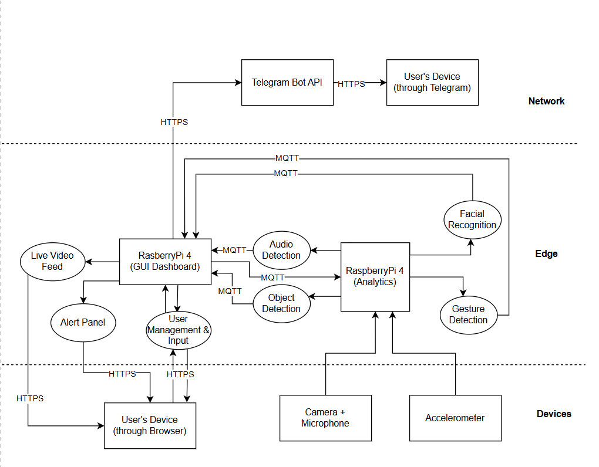
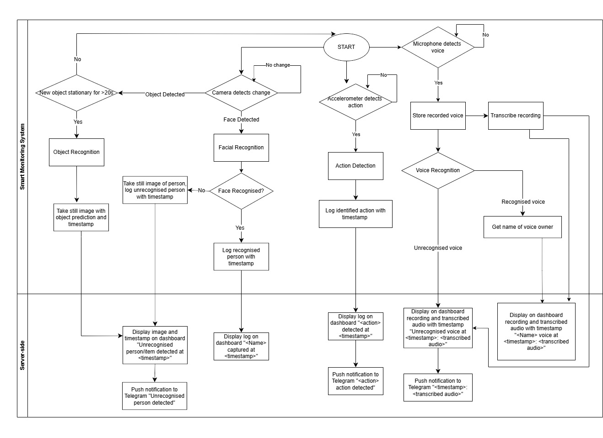

# Smart Monitoring System (Team 18)

This project is an **IoT-based smart monitoring solution** utilizing two **Raspberry Pi 4** devices:

- **Dashboard Pi (MERN Stack)**: Manages user interactions, displays live video, logs alerts, and integrates Telegram notifications.
- **Analytics Pi (AI Processing)**: Performs **object detection, facial recognition, audio monitoring, and gesture recognition**, then sends results to Dashboard Pi via **MQTT**.

## 📌 **System Overview**

The system consists of multiple **sensors and AI models** that detect environmental changes and respond accordingly.

### **📷 Live Video Feed**

- Users can view the live camera feed **from the Analytics Pi** on the dashboard.
- Video is streamed via **MQTT/WebRTC**.

### **⚠️ Alert Panel**

- Displays **alerts sent by Analytics Pi** when a security event is detected.
- Alerts include:
  - Unrecognized faces
  - Suspicious objects (e.g., unattended parcels)
  - Unrecognized voices
  - Gesture-based intruder detection

### **👥 User Management**

- Users can **add, edit, or delete household members**.
- Registered users' **faces and voices** are stored for recognition.
- Unrecognized individuals trigger **security alerts**.

### **📩 Telegram Notifications**

- When an **alert is triggered**, it is:
  1. **Logged into MongoDB**.
  2. **Displayed on the alert panel**.
  3. **Sent as a Telegram message** via the bot.

---

## **📜 System Architecture**

This project is structured as follows:

```
smart-monitoring-system/
│── 📂 dashboard_pi/                 # Dashboard Raspberry Pi (MERN stack, UI, storage)
│    ├── 📂 backend/                  # Express.js API & MQTT processing
│    │    ├── routes/                 # API endpoints
│    │    ├── models/                 # MongoDB schemas for logs & users
│    │    ├── services/               # MQTT & Telegram handlers
│    │    ├── server.js               # Main Express.js backend
│    ├── 📂 frontend/                  # React.js dashboard UI
│    │    ├── src/                     # Components & pages
│    │    ├── package.json             # React dependencies
│    ├── 📂 database/                  # Local MongoDB storage
│
│── 📂 analytics_pi/                   # AI Processing Raspberry Pi (Machine Learning)
│    ├── 📂 mqtt/                       # MQTT clients for AI processing
│    ├── 📂 ai_models/                  # AI models for detection
│    ├── 📂 devices/                    # Sensor data collection scripts
│    ├── analytics_main.py              # Main script for Analytics Pi (Runs everything)
│
│── 📂 docs/                            # Documentation
│    ├── system_architecture_block_diagram.jpeg
│    ├── flow_diagram.jpeg
│    ├── DesignDocument_Team18.pdf
│
│── .gitignore                          # Ignore unnecessary files
│── README.md                           # Project overview, setup instructions
│── docker-compose.yml                   # Docker for running services
```

---

## **🖼️ Architecture & Flow Diagram**

### **System Architecture**



### **Flow Diagram**



---

## **🚀 Setup Instructions**

### **🔧 Hardware Requirements**

- **2 x Raspberry Pi 4 (4GB RAM minimum recommended)**
- **Raspberry Pi Camera Module** (for Analytics Pi)
- **USB Microphone** (for Analytics Pi)
- **Accelerometer Sensor** (for Analytics Pi)
- **MicroSD Card (32GB or larger)**
- **Power Supply for Raspberry Pi**
- **Local Network Connection (WiFi or Ethernet)**

### **🖥️ Setting Up Dashboard Pi** (MERN Stack, MongoDB, MQTT)

#### **1️⃣ Install Dependencies**

```bash
cd dashboard_pi/backend
npm install
cd ../frontend
npm install
```

#### **2️⃣ Start MongoDB**

```bash
sudo systemctl start mongod
node dashboard_pi/database/database_setup.js
```

#### **3️⃣ Start Dashboard Services (Backend & Frontend)**

```bash
cd dashboard_pi/backend
node server.js  # Runs backend (includes MQTT handling & Telegram bot)
```

```bash
cd ../frontend
npm start  # Starts React.js frontend
```

---

### **🖥️ Setting Up Analytics Pi** (AI Processing, Sensors, MQTT)

#### **1️⃣ Install Dependencies**

```bash
cd analytics_pi
pip install -r requirements.txt
```

#### **2️⃣ Start Analytics Services**

```bash
python analytics_main.py  # Runs AI models, MQTT communication, and sensors asynchronously
```

---

## **📌 Features Overview**

| Feature                | Description                                                         |
| ---------------------- | ------------------------------------------------------------------- |
| 🎥 **Live Video Feed** | View live camera feed from **Analytics Pi** on the dashboard.       |
| 🚨 **Alert Panel**     | Displays **security alerts** sent by Analytics Pi via MQTT.         |
| 👤 **User Management** | Add/edit/delete household members for **face & voice recognition**. |
| 🔔 **Telegram Alerts** | Sends **real-time notifications** for security events.              |

---

## **📜 Design Document**

For detailed project documentation, refer to **`docs/DesignDocument_Team18.pdf`**.

---

## **🤝 Team Members**

| Team Members            | Student ID |
| ----------------------- | ---------- |
| Abdullah Waafi Bin Adam | 2201228    |
| Gavin Tang Bing Yuan    | 2203660    |
| Goh Shuang Claire       | 2202682    |
| Claris Toh              | 2203422    |
| Vianiece Tan Yingqi     | 2202045    |

---

## **📜 License**

This project is licensed under **MIT License**.

---

### **🚀 Ready to Deploy?**

This **modular and scalable** system ensures **real-time security monitoring** with **AI-driven recognition**. Let us know if you need any modifications! 🎯
